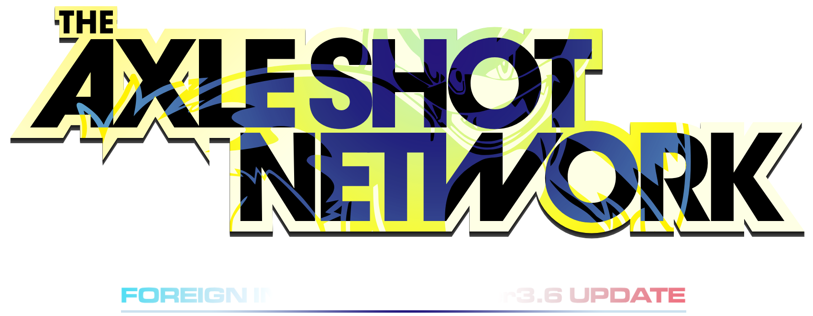
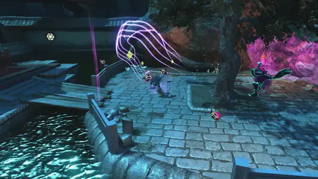
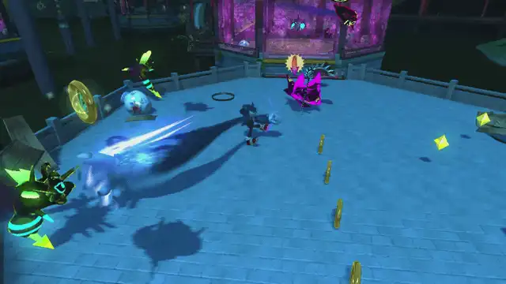

# **<u>The Axle Shot Network</u>, by ini of Cooliniau**

The Axle Shot Network (ASN) is an *offensive & evasive mobility subsystem* made within <u>***Foreign Input System***</u>—which focused on expanding the combo capabilities of the Werehog. These two elements are showcased with the **Ricochet System** & **Axle Traversal System** respectively: the former leading to pinball-esque attacks, and the latter leading to a different means of on-field & in-combat traversal.

---

### Ways to access ASN...

**"[[ ]]" means hold; usually during the on-going attack animation, however the timing can vary!*

**(Base & Unleash) While in combos:**

- Double Axle Combo: YYY-X-[[A]] 
  
  - PlayStation: Tri-Tri-Tri >> Sqr >> [[Crs]]

- Tricky Tornado Uppercut: (LB + LS Back + Y) -> [[A]]; can press "A / Cross" again to initiate another Axle Homing Shot.
  
  - PlayStation: (R1 + LS Back + Tri) -> [[Crs]]

- Unleashed Wild Combo: XX-YY-XX-Y-[[A]]; can press "A / Cross" again to initiate another Axle Homing Shot.
  
  - PlayStation: Sqr-Sqr >> Tri-Tri >> Sqr-Sqr >> Tri >> [[Crs]]
  
  - If you press X* at XX-YY-XX-Y-(X*) and miss the early on-hit Multi-Kick, you may be able to go into ASN late.
    
    - PlayStation: Sqr* at Sqr-Sqr >> Tri-Tri >> Sqr-Sqr >> Tri >> (Sqr*)

- During *any* Self-Launcher, press "A / Cross" or "B / Circle" to do either an Axle Homing Shot or Axle Dive.
  
  - Air Level 2 (Self-Launch after a prior Launcher) can only do Axle Dive with both "A" and "B".

<u>***Disclaimer:***</u>
All of the footage presented here are produced from *earlier builds* of ASN—as such, any inconsistencies between this and the GameBanana release ***should be expected***. Treat what you see here as examples of what to at least look out for when learning ASN. - ini

---

### Ricochet System

</img>

Performing the Axle Homing Shot will send you straight into the Ricochet System.
Inputs for each Axle Ricochet bounce are as follows:

##### ***Ricochet Lv. 1*** - If you bounce *once*, on-hit:

(*UI = Unique Input)

</img>

- Y / Triangle = 1st UI Flying Double Punch

- X / Square = 1st UI Aerial Claw Slash
  
  - These first two can lead into the Air Levels, like how FIS handles them.

- A / Cross = **Altered Typhoon Finisher**
  
  - Pressing A again initiates an <u>Axle Dive Lv. 1</u>, and another A press transitions into the Typhoon Finisher; sequence is ***loopable on-hit***.
  
  - Should the Axle Dive land on an enemy/object, you will re-activate the 1st R-Bounce, which you can simply let loose to see if you can get a HIGHER level mid-combat...

- B / Circle = Aerial Rush

##### ***Ricochet Lv. 2*** - If you bounce *twice*, on-hit:

[Camera will **zoom out**.]

(*UI = Unique Input)

</img>

- Y / Triangle = 1st UI Shooting Star

- X / Square = 1st UI Typhoon

- A / Cross = <u><strong>Altered Aerial Dive-Kick</strong></u>
  
  - This Dive-Kick has 2 parts to it: *early & late*. <u>Early</u> on-hit leads into an Altered Multi-Kick, and <u>Late</u> on-hit leads to an Uncurled Axle Bound.
  
  - Early / Late differences:
    
    - Y / Triangle = 1st UI Rising Sweep (early) / Crescent Moon Strike Finisher (late)
    
    - X / Square = 1st UI Crossing Windmill (early) / Hurricance Combo Finisher (late)
    
    - A / Cross = Altered Typhoon Finisher
    
    - B / Circle = Ricochet Kick
  
  - All of these offer ways to get back to the 1st Ricochet, but this time from your *current position*.

- B / Circle = Aerial Rush

##### ***Ricochet Lv. 3*** - If you bounce *thrice*, on-hit:

[Camera will **zoom out further** & game will **slow down** temporarily.]

(*UI = Unique Input)

</img>

- Y / Triangle = Axle Dive Lv. 2

- X / Square = 1st UI Typhoon

- A / Cross = <u><strong><em>Axle Homing Shot (Forward)</em></strong></u>
  
  - This grants a taste of the Unleashed Axle Shot Network by allowing you to initiate <u>3 Axle Homing Shots</u> & <u>3 forward Ricochet Bounces</u>—the **3rd of each** being *loopable* should you always be able to land a hit.
  
  - That said, if any of your Axle Homing Shots *miss*, you will pause via Multi-Kick...
    
    - The 1st two Multi-Kicks allow you to continue your AHS chain, but pressing A during the 3rd will activate the *Ricochet Kick*. Should it connect, you'll re-start the Ricochet System.
    
    - Homing Chain options:
      
      - X / Square = Altered Aerial Dive-Kick
      - B / Circle = Flying Double-Punch Crush Finisher
        - Can be useful for stopping the action early...or if you just want to look cool, lol.
    
    - Multi-Kick options prior to / on the 3rd:
      
      - Y / Triangle = Axle Dive Lv. 2
        - On-hit, you will initiate 2nd Level Ricochet Bounce and its options.
        - On-miss, you will initiate the Uncurled Axle Bound and its options.
      - X / Square = 1st UI Typhoon
      - A / Cross = Continue Axle Homing Shot (prior to 3rd M-K) / Ricochet Kick (on the 3rd M-K)
      - B / Circle = Aerial Rush

- B / Circle = Aerial Rush

---

### Axle Traversal System

</img>

If the Axle Homing Shot ever misses its foe(s), or if you see a slide on the ground...
You can expect to go into the Axle Traversal System (ATS).

**Ways to access ATS...**

- ANY time you see a specific type of <u>slide w/ an effect</u>, that is the Axle Slide.
  
  - To initiate the Axle Jump, try pressing "B / Circle" on:
    
    - 2nd UI Rolling Kick
    
    - 2nd UI Double Kick
    
    - Missing an on-hit Were-Shot and rebounding from the ground
  
  - You can also press "A / Cross" on:
    
    - Any of the last 3 inputs of Wild Whirl / Were-Hammer (after Axle Slide)
    
    - Rolling Kick Finisher
    
    - Double Kick Finisher
    
    - Either of the first 2 inputs of Egg Scrambler / Donkey Kick (after Axle Slide)
    
    - Double Axle Combo (on-miss)
    
    - Were-Claw Charge
      
      - Time a Hold "A / Cross" press at the beginning to immediately activate.
    
    - Triple Wild Claw
      
      - Time a Hold "A / Cross" press at the beginning to immediately activate.
    
    - During the Rolling action of Stallion Stampede / Meteor Kick / Dragoon's Doom

- The Axle Slide can also initiate after a *dormant* Axle Ricochet bounce (as in you do nothing during that).

- To perform <u><em>Axle Traversal</em></u>, repeatedly press the "A / Cross" button after an Axle Jump—this should lead to a sequence of Axle Kick >> Axle Slide >> Axle Jump >> repeat.
  
  - There may be instances during combat / exploration where the Werehog would go into free-fall during the Dive-Kick via sliding off an enemy's model or oddly-sized object collision...
    
    - Unfortunately, that is one of many weird quirks with Sonic Unleashed I wish we could do without LOL.
  
  

- The Axle Slide in of itself also has a few options for the X / Square, Y / Triangle, and B / Cross inputs:
  
  - Y / Triangle = 1st UI Rolling Kick
  
  - X / Square= 1st UI Double Kick
  
  - B / Cross= Spinning Were-Clap (moveable)
    
    - If you also wish to do this move during regular combos...
      
      - Hold "Y / Triangle" around the start of 3rd UI Wild Whirl
      
      - Hold "Y / Triangle" during the Rolling Kick Finisher
      
      - Hold "Y / Triangle" around the ending to 1st UI Double Axle

**While in the Axle Traversal System [ATS], here's how you can go into the Ricochet System from there:**
(The following must be done during an *Axle Slash*, which is "X / Square, Y / Triangle, or B / Circle" after doing an Axle Jump)

</img>

- Pressing "A / Cross" during the Axle Slash leads to an Axle Homing Shot.
  
  - Pressing "A / Cross" (Axle Homing Shot / AHS) or "B / Circle" (Ricochet Kick / RK) after the 2nd unique input (UI) of Crossing Windmill will get you into Axle Ricochet, if connected.
    
    - Crossing Windmill (*w/ Axle Slash): 
      
      - AHS: X*-X-X-A / Sqr >> Sqr >> Sqr >> Crs
      
      - RK: X*-X-X-B / Sqr >> Sqr >> Sqr >> Circ
      
      </img>
  
  - Pressing "A / Cross" (Axle Dive) or "B / Circle" (Ricochet Kick) after the 2nd UI of Rising Sweep will get you into Axle Ricochet, if connected.
    
    - Rising Sweep (*w/ Axle Slash):
      
      - AHS: Y*-Y-Y-A / Tri >> Tri >> Tri >> Crs
        
        - Holding "A" during the later part of the 2nd UI leads to Axle Dive Lv. 2
      
      - RK: Y*-Y-Y-B / Tri >> Tri >> Tri >> Circ
      
      </img>
  
  - Pressing "B / Circle" after the Axle Slash will activate the Ricochet Kick—if it connects, you will be in Axle Ricochet.

---

### Lesser Unleash State & Greater Unleash State

Now, when going into Unleash Mode, there are two states to concern yourself with: Lesser & Greater Unleash.

Simply put:

- <u>*Lesser Unleash*</u> is slower, yet has access to Axle Traversal combos that CAN send you into Greater Unleash.
  
  
  
  - Axle Homing Shot Mode, after **on-hit Ricochet:**
    
    - Y / Triangle = Unleashed Axle Dive Lv. 1
    
    - A / Cross = Lesser Axle Shot (Forwards)
    
    - B / Circle = State Switch Kick
      
      - If connected with an enemy, the game will slow down & your Axle Shot options will upgrade in speed (x2).
      
      - Multi-Kick acts as a chance to refresh Greater Unleash w/ the SSK.
    
    - X / Square = Crossing Windmill
      
      - Continuously mashing X / Square will lead to a slightly longer Multi-Kick Pause...
        
        - During this Pause, *ALL buttons* lead back to a regular Axle Homing Shot.
        
        - If you manage to land this Multi-Kick on an enemy, it leads to the same on-hit outcome as SSK.
  
  - Axle Homing Shot Mode, after an ***Axle Rebound* from the ground:**
    
    - Y / Triangle = Rising Sweep
      
      - Continuously mashing Y will lead to a slightly longer Multi-Kick Pause...
        - During this Pause, *ALL buttons* lead back to a regular Axle Homing Shot.
        - If you manage to land this Multi-Kick on an enemy, it leads to the same on-hit outcome as SSK.
    
    - X / Square = Crossing Windmill
      
      - Continuously mashing X will lead to a slightly longer Multi-Kick Pause...
        - During this Pause, only the "A" and "B" buttons are available—both lead back to a regular Axle Homing Shot.
        - If you manage to land this Multi-Kick on an enemy, it leads to the same on-hit outcome as SSK.
    
    - A / Cross = Lesser Axle Shot (Forwards)
    
    - B / Circle = State Switch Kick
      
      - Is less steep in verticality & slower than Greater Unleash Kick.
      - If connected with an enemy, the game will slow down temporarily (not always constant if you're fast enough) & your Axle Shot options will upgrade in 2x speed.
      - Multi-Kick acts as a chance to refresh Greater Unleash w/ the SSK.
      - Acts as <u>Slide-less</u> "Axle Traversal" on-landing.

- <u>***Greater Unleash***</u> is *VERY* fast, very easy to lose & has no access to Axle Traversal attacks.
  
  
  
  - Axle Homing Shot Mode, after <u>**on-hit State Switch Kick**</u>:
    
    - Y / Triangle = Unleashed Axle Dive Lv. 2
      
      - Has a camera & game speed indicator on-hit.
      - Hitting Y activates the 2nd UI of Rising Sweep, saving an extra input.
    
    - X / Square = Greater Unleash Kick
      
      - Is steeper in verticality & faster than the State Switch Kick.
      - If connected with an enemy, you will maintain Greater Unleash w/ no slo-mo (has camera zoom out for indication).
      - Multi-Kick acts as a chance to refresh Greater Unleash w/ the SSK.
    
    - A / Cross = Greater Axle Shot (Forwards)
    
    - B / Circle = Greater Axle Shot (Backwards)
  
  - In Greater Unleash, the Kick switching to the X / Square button is pretty much prevent spamming the B / Cross button for the same move—since both G-Unleash Kick & G-Axle Shot lead to a backwards outcome, it's better to let you experience the speeds of the Greater Unleash State sooner w/ a Sped Up Axle Homing Shot.
  
  - If you manage to maintain Greater Unleash when the Unleash Meter runs out, you'll be in a state similar to the activatable Team Blast in <u>*Sonic Heroes*</u>—in other words, so long as you can keep it up, you can keep doing Greater Unleash Mode actions as base Werehog. - ini

---

## One last thing...

Make sure to be mindful of your **surroundings** while in this form of play—your skills in improvisation WILL be put to the test !!

Other than that—<u>***have a blast "logging into" the Axle Shot Network***</u>. - ini

---

---

