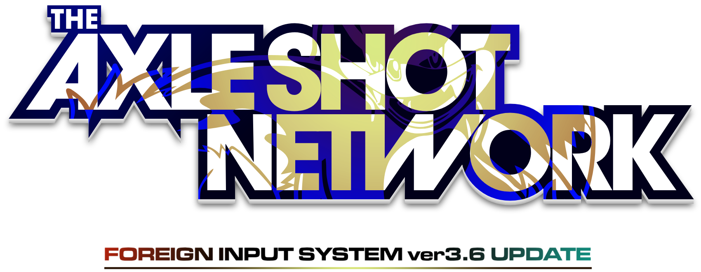
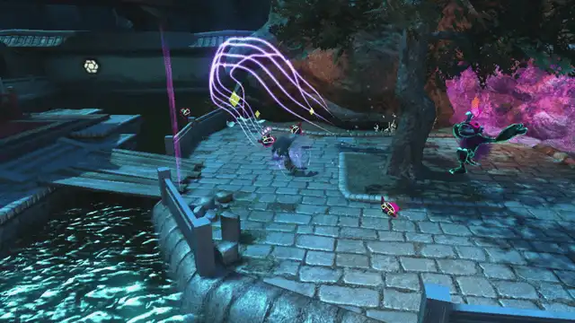
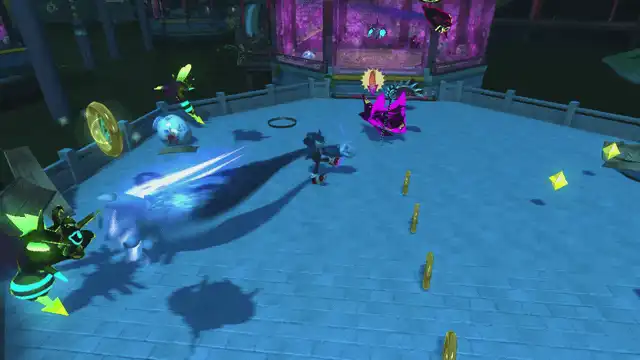

# **<u>The Axle Shot Network</u>, by ini of Cooliniau**

---

The Axle Shot Network (ASN) is an *offensive & evasive mobility subsystem* made within <u>***Foreign Input System***</u>—which focused on expanding the combo capabilities of the Werehog. These two elements are showcased with the **Ricochet System** & **Axle Traversal System** respectively: the former leading to pinball-esque attacks, and the latter leading to a different means of on-field & in-combat traversal.

  <figcaption>
    <i>Featured in the <a href="https://www.youtube.com/embed/WDx-yhtwyew?rel=0">"SONIC UNLEASHED: Foreign Input System 2nd Anniversary Update"</a> trailer.</i>
  </figcaption>

---

## If you wish to see MORE details on this subsytem...

Be sure to visit the website!

[FIS - The Axle Shot Network](https://cooliniau.github.io/AxleShotNetwork/)

    <a href="https://cooliniau.github.io/AxleShotNetwork/"></img></a>

Other than that—<u>***have a blast "logging into" the Axle Shot Network***</u>. - ini

---

---

