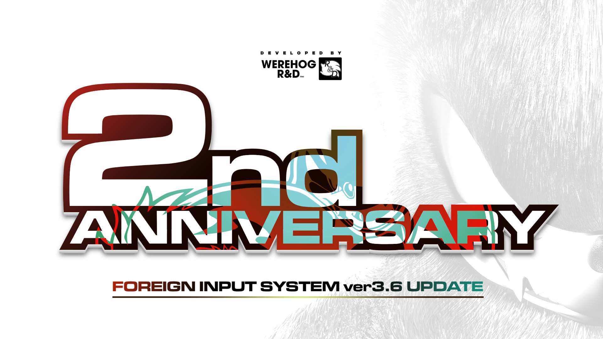
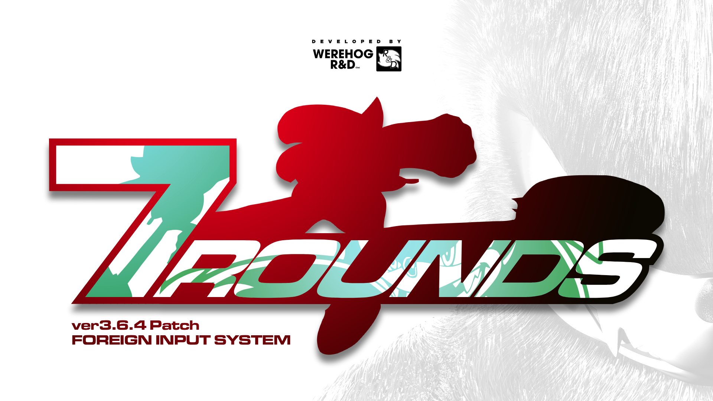

# **<u>The Axle Shot Network</u>, by ini of Cooliniau**

    </img>

    </img>

The Axle Shot Network (ASN) is an *offensive & evasive mobility subsystem* made within <u>***Foreign Input System***</u>—which focused on expanding the combo capabilities of the Werehog. These two elements are showcased with the **Ricochet System** & **Traversal System** respectively: the former leading to pinball-esque attacks, and the latter leading to a different means of on-field & in-combat traversal.

## If you wish to see MORE details on this subsystem of FIS...

Be sure to visit the website below!

[Foreign Input System for SONIC UNLEASHED - The Axle Shot Network](https://cooliniau.github.io/AxleShotNetwork/)

    <a href="https://cooliniau.github.io/AxleShotNetwork/"></img></a>

## Related Links

- <strong>Foreign Input System, for SONIC UNLEASHED:</strong>
  
  - Recompiled: [Foreign Input System (Recompiled) Mod for Unleashed Recompiled | UR Mods](https://gamebanana.com/mods/581483)
  
  - Console: [Foreign Input System (Console Edition) Mod for Sonic Unleashed (X360/PS3) | SUHD Mods](https://gamebanana.com/mods/504230)

- **The Axle Shot Network, for FIS ver3.6:**
  
  - [SONIC UNLEASHED: Foreign Input System 2nd Anniversary Update - YouTube](https://youtu.be/WDx-yhtwyew)
    
    
  
  - [The 7-Rounds Update | Foreign Input System for SONIC UNLEASHED - YouTube](https://www.youtube.com/watch?v=wlTS94qCygw)
    
    
